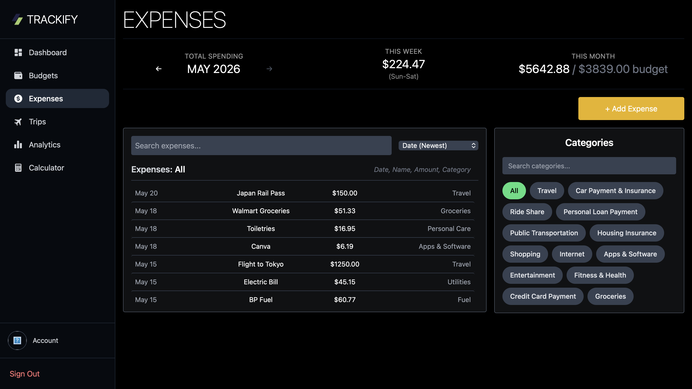
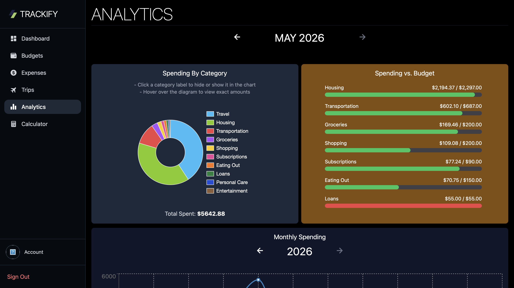

# Trackify

Trackify is a full-stack expense tracking web app that helps users manage their money, organize expenses, track budgets, view spending analytics, and plan trips without overspending.

## Features

- User authentication with Supabase
- Create, edit, and delete expenses
- Organize expenses by category and budget group
- Set and track monthly budgets
- View spending vs. budget progress
- Analyze monthly spending with charts
- Create trips with custom budgets
- Attach expenses to trips
- Upload and update profile pictures
- Demo user mode with seeded sample data
- SQL examples folder with CRUD operations and calculation queries

## Tech Stack

- React
- JavaScript
- Tailwind CSS
- React Router
- Supabase Auth
- Supabase Database
- Supabase Storage
- SQL
- Chart.js
- Recharts

## Pages

### Landing Page


### Dashboard


### Expenses



### Budgets


### Trips


### Analytics



### Account


## Demo

Trackify includes a demo user option that allows visitors to explore the app with sample expenses, budgets, trips, and analytics.

## SQL Examples

This project includes a `sql-examples` folder with sample SQL queries that demonstrate how the app's data can be queried and manages directly at the database level.

The SQL examples include:

- Creating, reading, updating, and deleting expense records
- Counting expenses based on trip assignment
- Calculating total spending for trips
- Calculating remaining trip budgets
- Grouping expenses by categories
- Practicing joins, filtering, aggregation,a dn grouped calculations
- Creating and dropping the expense table

## What I Learned

While building Trackify, I practiced:

- Building reusable React components
- Managing state across dashboard pages
- Working with Supabase authentication
- Reading and writing relational data with Supabase
- Uploading and displaying profile images with Supabase Storage
- Creating responsive layouts with Tailwind CSS
- Building charts and analytics from user data
- Handling monthly budget history and expense filtering
- Writing SQL CRUD queries for expense data
- Writing SQL calculation queries using joins, grouping, filtering, and aggregate functions

## Future Improvements

- Improve the mobile dashboard experience with small layout adjustments
- Add savings features for tracking savings goals and progress
- Add email reminders for budget limits
- Expand analytics with more spending trends and insights

## Live Demo

Trackify will be available here once deployed:

[View Live Site](site-url)

## Installation

Clone the repository:

```bash
git clone https://github.com/tyshonbrown/trackify.git
```

Install dependencies:

```bash
npm install
```

Start the development server:

```bash
npm run dev
```

## Environment Variables

To run this project locally, create a `.env` file in the `frontend` folder and add:

```env
VITE_SUPABASE_URL=your_supabase_url
VITE_SUPABASE_ANON_KEY=your_supabase_anon_key
```