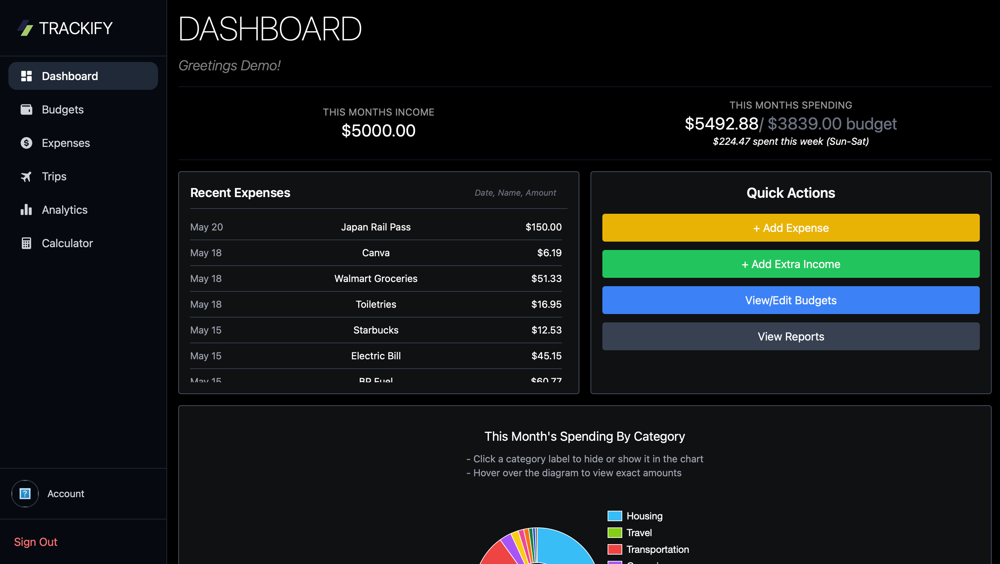
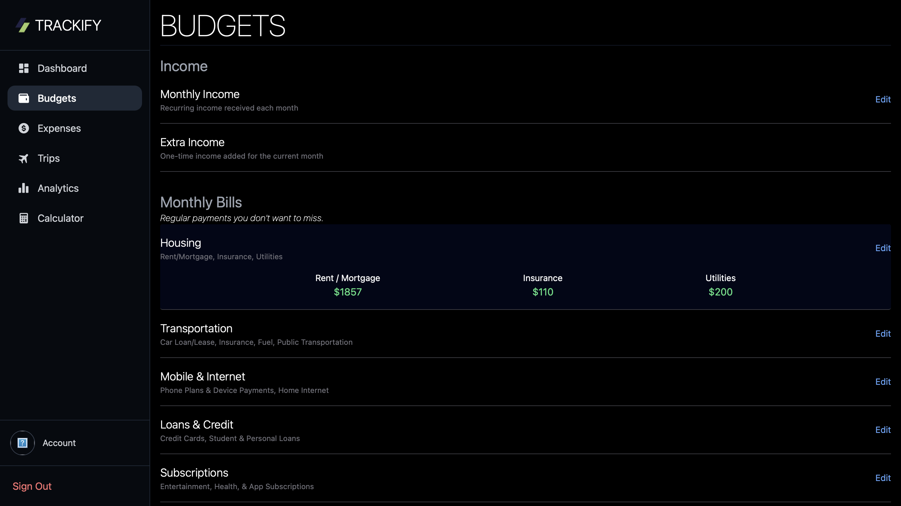
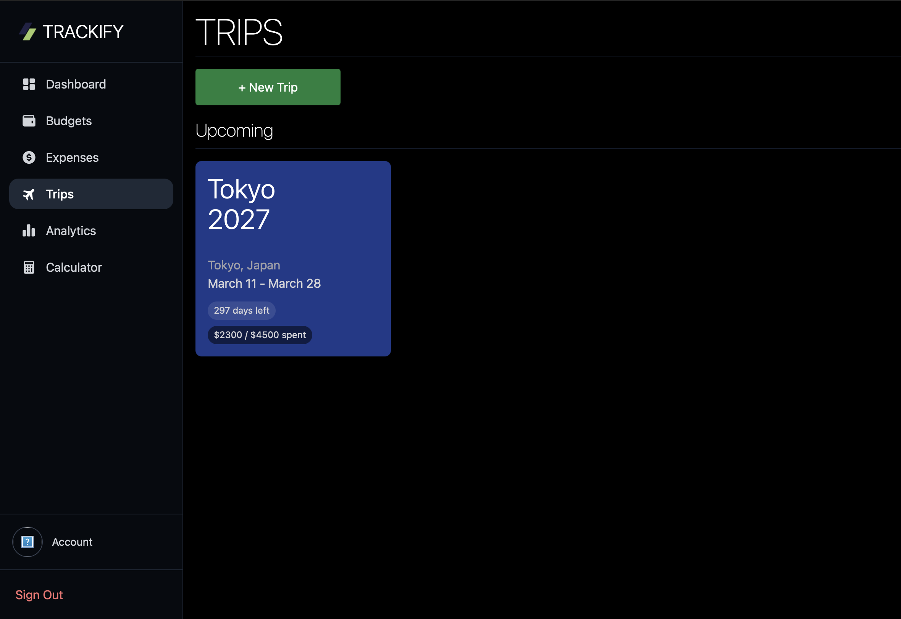
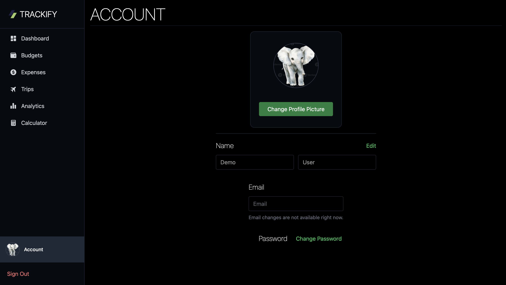

# Trackify

Trackify is a full-stack expense tracking web app that helps users manage their money, organize expenses, track budgets, view spending analytics, and plan trips without overspending.

## Features

- User authentication with Supabase
- Create, edit, and delete expenses
- Organize expenses by category and budget group
- Set and track monthly budgets
- View spending vs. budget progress
- Analyze monthly spending with charts
- Create trips with custom budgets
- Attach expenses to trips
- Upload and update profile pictures
- Demo user mode with seeded sample data

## Tech Stack

- React
- JavaScript
- Tailwind CSS
- React Router
- Supabase Auth
- Supabase Database
- Supabase Storage
- Chart.js
- Recharts

## Screenshots

### Landing Page


### Dashboard


### Expenses


### Budgets


### Trips


### Analytics


### Account


## Demo

Trackify includes a demo user option that allows visitors to explore the app with sample expenses, budgets, trips, and analytics.

## What I Learned

While building Trackify, I practiced:

- Building reusable React components
- Managing state across dashboard pages
- Working with Supabase authentication
- Reading and writing relational data with Supabase
- Uploading and displaying profile images with Supabase Storage
- Creating responsive layouts with Tailwind CSS
- Building charts and analytics from user data
- Handling monthly budget history and expense filtering

## Future Improvements

- Improve the mobile dashboard experience with small layout adjustments
- Add savings features for tracking savings goals and progress
- Add email reminders for budget limits
- Expand analytics with more spending trends and insights

## Installation

Clone the repository:

```bash
